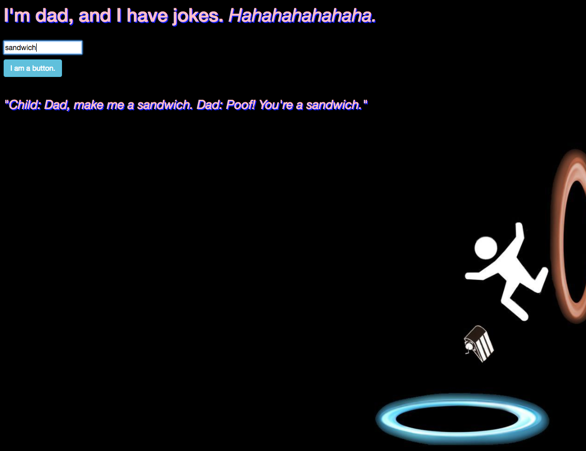

# React/Redux Dad Joke API

#### _React/Redux API Project for Epicodus, September 26th, 2017_
**_By Calla Rudolph_ [(e-mail me here)](<mailto:callarudolph@gmail.com>)**

## Description
This React/Redux JS app was created to practice using API calls with Redux-Thunk Middleware. Special thanks to the Dad Joke API: https://icanhazdadjoke.com/api

## Prerequisites
* [Node.js](https://nodejs.org/) (with NPM)

## Installation Instructions
* Open Terminal and type:
* `$ cd Desktop`
* `$ git clone https://github.com/CallaRudolph/dad-joke-api`
* `$ cd dad-joke-api`
* `$ npm install`
* `$ atom .`

### Serving Program
* In Terminal, run `$ npm run start`
* In your Browser (Chrome preferred) navigate to [http://localhost:8080/](http://localhost:8080/)

## Technologies Used
* [Node.js](https://nodejs.org/) (with NPM)
* [ReactJS](https://facebook.github.io/react/)
* [Redux](http://redux.js.org/)
* [Webpack](https://webpack.js.org/)
* [Babel](https://babeljs.io/)
* Bootstrap/CSS
* HTML

## License Information
Copyright &copy; 2017 Calla Rudolph

_Please email me at the above address with any comments or improvements you have found!_

This software is licensed under the MIT license.
